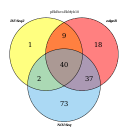

```{r setup, include=FALSE}
knitr::opts_chunk$set(echo = TRUE)
library(rvest)
```


# Sección 1 - Página Principal


Data Analysis module allows the user to have a preliminary analysis for quality control based on the data distribution per sample, using plots below

[](DataAnalysis_Results/AllConditions_CPMPlot.pdf)
*Fig. 1. CPM, Counts Per Million Plot*

The Count per million (CPM) plot shows the number of genes within each sample having more than 0 CPM, or more than 1, 2, 5 and 10 CPM. This plot could help the user decide the threshold to remove genes that appear to be very lowly expressed in any of the experimental conditions.

[](DataAnalysis_Results/AllConditions_BoxPlotLog2.pdf)
*Fig. 2. Boxplot with pseudo counts*

Samples boxplot provides an easy way to visualize the distribution of pseudocounts in each sample, since it shows statistical measures such as median, quartiles, minimum and maximum. Whiskers are also drawn extending beyond each end of the box with points beyond the whiskers typically indicating outliers.

[](DataAnalysis_Results/AllConditions_DensitiesPlot.pdf)
*Fig. 3. Density plot*

Pseudocounts distributions can also be summarized by means of a density plot. Density plot provides more detail by enabling, for example, the detection of dissimilarity in replicates' behavior.

[](DataAnalysis_Results/AllConditions_MDSPlot.pdf)
*Fig. 4. Multi-dimensional scaling plot*

Multidimensional Scaling (MDS) is a technique that is used to create a visual representation of the pattern of proximities (similarities, dissimilarities, or distances) among a set of objects. In the context of RNA-Seq analysis, MDS plot shows variation among RNA-seq samples, distance between sample labels indicates dissimilarity.

[](DataAnalysis_Results/AllConditions_PCAPlot.pdf)
*Fig. 5. Principal component plot*

This type of plot is useful for visualizing the overall effect of experimental covariates and batch effects. In the context of RNA-Seq analysis, PCA essentially clusters samples by groups of the most significantly deregulated genes. Clustering first by the most significant group, then by progressively less significant groups.

[](DataAnalysis_Results/AllConditions_BoxPlotNorm.pdf)
*Fig. 6. Boxplot of standardized counts with TMM*

[](DataAnalysis_Results/AllConditions_MDSPlotNorm.pdf)
*Fig. 7. Multi-dimensional scaling plot of standardized counts with TMM*

[](DataAnalysis_Results/AllConditions_PCAPlotNorm.pdf)
*Fig. 8. Principal component plot of standardized counts with TMM*

This type of graph is useful for visualizing the overall effect of experimental covariances and their batch effects. When a pair of samples, under the same condition, tend to group together, a lot effect can be suspected.

From this point, the same graphs are replicated, but they show the raw counts normalized with the TMM method (Trimmed Mean of M-values), (1) Robinson.


# Sección 2 - EdgeR.php

In this section, we present the results of the differential expression analysis generated by the edgeR method. (1)

## Result Files

The following text files contain the results of differential expression analysis for various comparisons:

The text files can be opened in Excel and contain the result of the differential expression analysis for all genes with significant counts. The meaning of each column is as follows:

1. **id**: The gene ID (gene, transcript, etc.)
2. **log2FoldChange**: The log fold-change between conditions being tested
3. **logCPM**: Average log2-counts per million, averaged over all libraries
4. **p value**: The statistical significance of the change
5. **FDR**: False Discovery Rate adjusted for multiple testing with the Benjamini-Hochberg procedure

The last columns correspond to:

6. **raw counts**: Raw counts for all samples
7. **normalized counts**: Normalized counts for all samples
8. **Regulation**: Gene regulation, indicating how and in which condition the gene was expressed

- [<code>pEhExvsU2AF84_pval.txt</code>](edgeR_Results/pEhExvsU2AF84_pval.txt)
- [<code>pEhExvsEhMyb10.txt</code>](edgeR_Results/pEhExvsEhMyb10.txt)
- [<code>pEhExvsUmasM.txt</code>](edgeR_Results/pEhExvsUmasM.txt)
- [<code>pEhExvsCDC5.txt</code>](edgeR_Results/pEhExvsCDC5.txt)
- [<code>pEhExvsEhMyb10_Abundances.txt</code>](edgeR_Results/pEhExvsEhMyb10_Abundances.txt)
- [<code>pEhExvsU2AF84_TOP.txt</code>](edgeR_Results/pEhExvsU2AF84_TOP.txt)
- [<code>pEhExvsUmasM_logFC.txt</code>](edgeR_Results/pEhExvsUmasM_logFC.txt)
- [<code>pEhExvsCmasM.txt</code>](edgeR_Results/pEhExvsCmasM.txt)
- [<code>pEhExvsCmasM_Abundances.txt</code>](edgeR_Results/pEhExvsCmasM_Abundances.txt)
- [<code>pEhExvsUmasM_TOP.txt</code>](edgeR_Results/pEhExvsUmasM_TOP.txt)
- [<code>pEhExvsUmasM_pval.txt</code>](edgeR_Results/pEhExvsUmasM_pval.txt)
- [<code>pEhExvsU2AF84_Abundances.txt</code>](edgeR_Results/pEhExvsU2AF84_Abundances.txt)
- [<code>pEhExvsU2AF84_logFC.txt</code>](edgeR_Results/pEhExvsU2AF84_logFC.txt)
- [<code>pEhExvsCDC5_logFC.txt</code>](edgeR_Results/pEhExvsCDC5_logFC.txt)
- [<code>pEhExvsCmasM_logFC.txt</code>](edgeR_Results/pEhExvsCmasM_logFC.txt)
- [<code>pEhExvsCDC5_Abundances.txt</code>](edgeR_Results/pEhExvsCDC5_Abundances.txt)
- [<code>pEhExvsUmasM_Abundances.txt</code>](edgeR_Results/pEhExvsUmasM_Abundances.txt)
- [<code>pEhExvsEhMyb10_TOP.txt</code>](edgeR_Results/pEhExvsEhMyb10_TOP.txt)
- [<code>pEhExvsCDC5_pval.txt</code>](edgeR_Results/pEhExvsCDC5_pval.txt)
- [<code>pEhExvsEhMyb10_pval.txt</code>](edgeR_Results/pEhExvsEhMyb10_pval.txt)
- [<code>pEhExvsCmasM_TOP.txt</code>](edgeR_Results/pEhExvsCmasM_TOP.txt)
- [<code>pEhExvsEhMyb10_logFC.txt</code>](edgeR_Results/pEhExvsEhMyb10_logFC.txt)
- [<code>pEhExvsCDC5_TOP.txt</code>](edgeR_Results/pEhExvsCDC5_TOP.txt)
- [<code>pEhExvsCmasM_pval.txt</code>](edgeR_Results/pEhExvsCmasM_pval.txt)
- [<code>pEhExvsU2AF84.txt</code>](edgeR_Results/pEhExvsU2AF84.txt)

## Subgroup Analysis

Additional analysis files:


These "TOP.txt" files represent subgroup analyses and contain results only for differentially expressed genes based on the established cutoff parameters.

- [<code>pEhExvsU2AF84_TOP.txt</code>](edgeR_Results/pEhExvsU2AF84_TOP.txt)
- [<code>pEhExvsUmasM_TOP.txt</code>](edgeR_Results/pEhExvsUmasM_TOP.txt)
- [<code>pEhExvsEhMyb10_TOP.txt</code>](edgeR_Results/pEhExvsEhMyb10_TOP.txt)
- [<code>pEhExvsCmasM_TOP.txt</code>](edgeR_Results/pEhExvsCmasM_TOP.txt)
- [<code>pEhExvsCDC5_TOP.txt</code>](edgeR_Results/pEhExvsCDC5_TOP.txt)

The following files have genes that it was reported as differential expressed for more than one method,(EdgeR + other)


- [<code>pEhExvsCmasM_Intersect.txt</code>](edgeR_Results/pEhExvsCmasM_Intersect.txt)


## Gene Expression Plots

In the context of RNA-Seq analysis, MDS plot shows variation among RNA-seq samples, with the distance between sample labels indicating dissimilarity. When the experiment is well controlled, the greatest sources of variation should correspond to the treatments/groups of interest.

The Smear plot visualizes the results of a DE analysis, showing the log-fold change against log-counts per million. Differentially expressed features are highlighted in red.

The Volcano plot summarizes both fold-change and p-values. It is a scatter-plot of the negative log10-transformed p-values against the log2 fold change. Features declared as differentially expressed are highlighted in red.


[](edgeR_Results/pEhExvsCDC5_plotMDS.pdf){:target="_blank"}
[](edgeR_Results/pEhExvsU2AF84_plotVolcano.pdf){:target="_blank"}
[](edgeR_Results/pEhExvsUmasM_plotSmear.pdf){:target="_blank"}
[](edgeR_Results/pEhExvsCDC5_plotVolcano.pdf){:target="_blank"}
[](edgeR_Results/pEhExvsEhMyb10_plotMDS.pdf){:target="_blank"}
[](edgeR_Results/pEhExvsCDC5_plotSmear.pdf){:target="_blank"}
[](edgeR_Results/pEhExvsU2AF84_plotSmear.pdf){:target="_blank"}
[](edgeR_Results/pEhExvsCmasM_plotSmear.pdf){:target="_blank"}
[](edgeR_Results/pEhExvsUmasM_plotMDS.pdf){:target="_blank"}
[](edgeR_Results/pEhExvsEhMyb10_plotVolcano.pdf){:target="_blank"}
[](edgeR_Results/pEhExvsCmasM_plotVolcano.pdf){:target="_blank"}
[](edgeR_Results/pEhExvsCmasM_plotMDS.pdf){:target="_blank"}
[](edgeR_Results/pEhExvsU2AF84_plotMDS.pdf){:target="_blank"}
[](edgeR_Results/pEhExvsEhMyb10_plotSmear.pdf){:target="_blank"}
[](edgeR_Results/pEhExvsUmasM_plotVolcano.pdf){:target="_blank"}


# Sección 3 - DESeq2.php

## DESeq2 Results

Diferential Expression by DESeq2. (1)

The following text files (can be opened in Excel) they contains the result of differential expression analysis for all genes with significant counts. The meaning of e ach column is described below.

1. id : The first column is the id(gene, transcript, etc.)
2. baseMean: Mean normalised counts, averaged over all samples from the two conditions
3. log2FoldChange : logaritmo de la magnitud de cambio entre el par de condiciones, en la tercer columna
4. lfcSE: Standard errors of logarithm fold change
5. Stat: test statistics
6. pvalue: p value for the statistical significance of this change
7. padj: p value adjusted for multiple testing with the Benjamini-Hochberg procedure
The last columns correspond to:
6.  raw counts: Raw counts for all sample
7.  normalized counts: Normalized counts for all samples
8.  Regulation : gene regulation, indicating how and in which condition the genes was expressed

- [<code>pEhExvsU2AF84_pval.txt</code>](DESeq2_Results/pEhExvsU2AF84_pval.txt)

- [<code>pEhExvsEhMyb10.txt</code>](DESeq2_Results/pEhExvsEhMyb10.txt)

- [<code>pEhExvsUmasM.txt</code>](DESeq2_Results/pEhExvsUmasM.txt)

- [<code>pEhExvsCDC5.txt</code>](DESeq2_Results/pEhExvsCDC5.txt)

- [<code>pEhExvsEhMyb10_Abundances.txt</code>](DESeq2_Results/pEhExvsEhMyb10_Abundances.txt)

- [<code>pEhExvsU2AF84_TOP.txt</code>](DESeq2_Results/pEhExvsU2AF84_TOP.txt)

- [<code>pEhExvsUmasM_logFC.txt</code>](DESeq2_Results/pEhExvsUmasM_logFC.txt)

- [<code>pEhExvsCmasM.txt</code>](DESeq2_Results/pEhExvsCmasM.txt)

- [<code>pEhExvsCmasM_Abundances.txt</code>](DESeq2_Results/pEhExvsCmasM_Abundances.txt)

- [<code>pEhExvsUmasM_TOP.txt</code>](DESeq2_Results/pEhExvsUmasM_TOP.txt)

- [<code>pEhExvsUmasM_pval.txt</code>](DESeq2_Results/pEhExvsUmasM_pval.tx)

- [<code>pEhExvsU2AF84_Abundances.txt</code>](DESeq2_Results/pEhExvsU2AF84_Abundances.txt)

- [<code>pEhExvsU2AF84_logFC.txt</code>](DESeq2_Results/pEhExvsU2AF84_logFC.txt)

- [<code>pEhExvsCDC5_logFC.txt</code>](DESeq2_Results/pEhExvsCDC5_logFC.txt)

- [<code>pEhExvsCmasM_logFC.txt</code>](DESeq2_Results/pEhExvsCmasM_logFC.txt)

- [<code>pEhExvsCDC5_Abundances.txt</code>](DESeq2_Results/pEhExvsCDC5_Abundances.txt)

- [<code>pEhExvsUmasM_Abundances.txt</code>](DESeq2_Results/pEhExvsUmasM_Abundances.txt)

- [<code>pEhExvsEhMyb10_TOP.txt</code>](DESeq2_Results/pEhExvsEhMyb10_TOP.txt)

- [<code>pEhExvsCDC5_pval.txt</code>](DESeq2_Results/pEhExvsCDC5_pval.txt)

- [<code>pEhExvsEhMyb10_pval.txt</code>](DESeq2_Results/pEhExvsEhMyb10_pval.txt)

- [<code>pEhExvsCmasM_TOP.txt</code>](DESeq2_Results/pEhExvsCmasM_TOP.txt)

- [<code>pEhExvsEhMyb10_logFC.txt</code>](DESeq2_Results/pEhExvsEhMyb10_logFC.txt)

- [<code>pEhExvsCDC5_TOP.txt</code>](DESeq2_Results/pEhExvsCDC5_TOP.txt)

- [<code>pEhExvsCmasM_pval.txt</code>](DESeq2_Results/pEhExvsCmasM_pval.txt)

- [<code>pEhExvsU2AF84.txt</code>](DESeq2_Results/pEhExvsU2AF84.txt)


The following files with TOP.txt ending, it are subgroup of previos files, and it containing DE results only of the differentially expressed genes (considering the established cutoff parameters).

- [<code>pEhExvsU2AF84_TOP.txt</code>](DESeq2_Results/pEhExvsU2AF84_TOP.txt)

- [<code>pEhExvsUmasM_TOP.txt</code>](DESeq2_Results/pEhExvsUmasM_TOP.txt)

- [<code>pEhExvsEhMyb10_TOP.txt</code>](DESeq2_Results/pEhExvsEhMyb10_TOP.txt)

- [<code>pEhExvsCmasM_TOP.txt</code>](DESeq2_Results/pEhExvsCmasM_TOP.txt)

- [<code>pEhExvsCDC5_TOP.txt</code>](DESeq2_Results/pEhExvsCDC5_TOP.txt)

The following files have genes that it was reported as differential expressed for more than one method (DESeq2 + other)
 

- [<code>pEhExvsCDC5_Intersect.txt</code>](DESeq2_Results/pEhExvsCDC5_Intersect.txt)

- [<code>pEhExvsEhMyb10_Intersect.txt</code>](DESeq2_Results/pEhExvsEhMyb10_Intersect.txt)

- [<code>pEhExvsCmasM_Intersect.txt</code>](DESeq2_Results/pEhExvsCmasM_Intersect.txt)


## Graficas

plotPCA.pdfThis type of plot is useful for visualizing the overall effect of experimental covariates and batch effects (Love MI 2014).

plotMA.pdf, This plot represents each gene with a dot. The x axis is the average expression over the mean of normalized counts, the y axis is the log2 fold change between conditions. Features declared as differentially expressed are highlighted in red (Gonzalez 2014).
References:

[](DESeq2_Results/pEhExvsEhMyb10_plotPCA.pdf){:target="_blank"}
[](DESeq2_Results/pEhExvsUmasM_plotMA.pdf){:target="_blank"}
[](DESeq2_Results/pEhExvsUmasM_plotPCA.pdf){:target="_blank"}
[](DESeq2_Results/pEhExvsCmasM_plotMA.pdf){:target="_blank"}
[](DESeq2_Results/pEhExvsU2AF84_plotPCA.pdf){:target="_blank"}
[](DESeq2_Results/pEhExvsCmasM_plotPCA.pdf){:target="_blank"}
[](DESeq2_Results/pEhExvsCDC5_plotMA.pdf){:target="_blank"}
[](DESeq2_Results/pEhExvsCDC5_plotPCA.pdf){:target="_blank"}
[](DESeq2_Results/pEhExvsU2AF84_plotMA.pdf){:target="_blank"}
[](DESeq2_Results/pEhExvsEhMyb10_plotMA.pdf){:target="_blank"}


# Sección 4 - limma.php


## limma Results	

In this section the differential expression results generated by the limma method are shown.(1)

The following text files (can be opened in Excel) they contains the result of differential expression analysis for all genes with significant counts. The meaning of each column is described below. :

id : The first column is the id(gene, transcript, etc.),
log2FoldChange : The log fold-change between conditions being tested
AveExpr: Average log2 expression t: the t-statistic used to assess differential expression P.Value: The p-value for differential expression; this value is not adjusted for multiple testing adj.P.Val :The p-value adjusted for multiple testing B: The B-statistic is the log-odds that the gene is differentially expressed The last columns correspond to: raw counts: Raw counts for all sample
normalized counts: Normalized counts for all samples
Regulation : gene regulation, indicating how and in which condition the genes was expressed

- [<code>pEhExvsU2AF84_pval.txt</code>](limma_Results/pEhExvsU2AF84_pval.txt)

- [<code>pEhExvsEhMyb10.txt</code>](limma_Results/pEhExvsEhMyb10.txt)

- [<code>pEhExvsUmasM.txt</code>](limma_Results/pEhExvsUmasM.txt)

- [<code>pEhExvsCDC5.txt</code>](limma_Results/pEhExvsCDC5.txt)

- [<code>pEhExvsEhMyb10_Abundances.txt</code>](limma_Results/pEhExvsEhMyb10_Abundances.txt)

- [<code>pEhExvsU2AF84_TOP.txt</code>](limma_Results/pEhExvsU2AF84_TOP.txt)

- [<code>pEhExvsUmasM_logFC.txt</code>](limma_Results/pEhExvsUmasM_logFC.txt)

- [<code>pEhExvsCmasM.txt</code>](limma_Results/pEhExvsCmasM.txt)

- [<code>pEhExvsCmasM_Abundances.txt</code>](limma_Results/pEhExvsCmasM_Abundances.txt)

- [<code>pEhExvsUmasM_TOP.txt</code>](limma_Results/pEhExvsUmasM_TOP.txt)

- [<code>pEhExvsUmasM_pval.txt</code>](limma_Results/pEhExvsUmasM_pval.txt)

- [<code>pEhExvsU2AF84_Abundances.txt</code>](limma_Results/pEhExvsU2AF84_Abundances.txt)

- [<code>pEhExvsU2AF84_logFC.txt</code>](limma_Results/pEhExvsU2AF84_logFC.txt)

- [<code>pEhExvsCDC5_logFC.txt</code>](limma_Results/pEhExvsCDC5_logFC.txt)

- [<code>pEhExvsCmasM_logFC.txt</code>](limma_Results/>pEhExvsCmasM_logFC.txt)

- [<code>pEhExvsCDC5_Abundances.txt</code>](limma_Results/pEhExvsCDC5_Abundances.txt)

- [<code>pEhExvsUmasM_Abundances.txt</code>](limma_Results/pEhExvsUmasM_Abundances.txt)

- [<code>pEhExvsEhMyb10_TOP.txt</code>](limma_Results/pEhExvsEhMyb10_TOP.txt)

- [<code>pEhExvsCDC5_pval.txt</code>](limma_Results/pEhExvsCDC5_pval.txt)

- [<code>pEhExvsEhMyb10_pval.txt</code>](limma_Results/pEhExvsEhMyb10_pval.txt)

- [<code>pEhExvsCmasM_TOP.txt</code>](limma_Results/pEhExvsCmasM_TOP.txt)

- [<code>pEhExvsEhMyb10_logFC.txt</code>](limma_Results/pEhExvsEhMyb10_logFC.txt)

- [<code>pEhExvsCDC5_TOP.txt</code>](limma_Results/pEhExvsCDC5_TOP.txt)

- [<code>pEhExvsCmasM_pval.txt</code>](limma_Results/pEhExvsCmasM_pval.txt)

- [<code>pEhExvsU2AF84.txt</code>](limma_Results/pEhExvsU2AF84.txt)


The following files with TOP.txt ending, it are subgroup of previos files, and it containing DE results only of the differentially expressed genes (considering the established cutoff parameters).
The following files have genes that it was reported as differential expressed for more than one method,(limma + other)


- [<code>pEhExvsU2AF84_TOP.txt</code>](limma_Results/pEhExvsU2AF84_TOP.txt)

- [<code>pEhExvsUmasM_TOP.txt</code>](limma_Results/pEhExvsUmasM_TOP.txt)

- [<code>pEhExvsEhMyb10_TOP.txt</code>](limma_Results/pEhExvsEhMyb10_TOP.txt)

- [<code>pEhExvsCmasM_TOP.txt</code>](limma_Results/pEhExvsCmasM_TOP.txt)

- [<code>pEhExvsCDC5_TOP.txt</code>](limma_Results/pEhExvsCDC5_TOP.txt)

## Graph PlotPCA

the graph plotPCA.pdf is useful for visualizing the overall effect of experimental covariates and batch effects (Love MI 2014).

In plot plotMA.pdf it represents each gene with a dot. The x axis is the average expression over the mean of normalized counts, the y axis is the log2 fold change between conditions. Features declared as differentially expressed are highlighted in red (Gonzalez 2014).

**Click to enlarge the image**


[](limma_Results/pEhExvsCDC5_plotMDS.pdf){:target="_blank"}
[](limma_Results/pEhExvsCmasM_plotMD.pdf){:target="_blank"}
[](limma_Results/pEhExvsUmasM_plotMD.pdf){:target="_blank"}
[](limma_Results/pEhExvsU2AF84_plotMD.pdf){:target="_blank"}
[](limma_Results/pEhExvsEhMyb10_plotMDS.pdf){:target="_blank"}
[](limma_Results/pEhExvsCDC5_plotMD.pdf){:target="_blank"}
[](limma_Results/pEhExvsEhMyb10_plotMD.pdf){:target="_blank"}
[](limma_Results/pEhExvsUmasM_plotMDS.pdf){:target="_blank"}
[](limma_Results/pEhExvsCmasM_plotMDS.pdf){:target="_blank"}
[](limma_Results/pEhExvsU2AF84_plotMDS.pdf){:target="_blank"}


# Sección 5 - NOISeq.php


## NOISeq Results	

In this section the differential expression results generated by the NOISeq method are shown. (1)

The following text files (can be opened in Excel) they contains the result of differential expression analysis for all genes with significant counts. The meaning of each column is described below. :

1. id : The first column is the id(gene, transcript, etc.)
2. Cond1_mean: The second column is the mean of the biological replicates of first condition
3. Cond2_mean: the thirds column is the mean of the biological replicates of secondth condition
4. theta: the fourth column is a Differential expression statistics
5. Prop: the fifth column show Probability of differential expression
6. log2FoldChange : The log fold-change between conditions being tested
The last columns correspond to:
7. raw counts: Raw counts for all sample
8. normalized counts: Normalized counts for all samples
9. DE: gene regulation, indicating how and in which condition the genes was expressed


- [<code>pEhExvsU2AF84_pval.txt</code>](NOISeq_Results/pEhExvsU2AF84_pval.txt)

- [<code>pEhExvsEhMyb10.txt</code>](NOISeq_Results/pEhExvsEhMyb10.txt)

- [<code>pEhExvsUmasM.txt</code>](NOISeq_Results/pEhExvsUmasM.txt)

- [<code>pEhExvsCDC5.txt</code>](NOISeq_Results/pEhExvsCDC5.txt)

- [<code>pEhExvsEhMyb10_Abundances.txt</code>](NOISeq_Results/pEhExvsEhMyb10_Abundances.txt)

- [<code>pEhExvsU2AF84_TOP.txt</code>](NOISeq_Results/pEhExvsU2AF84_TOP.txt)

- [<code>pEhExvsUmasM_logFC.txt</code>](NOISeq_Results/pEhExvsUmasM_logFC.txt)

- [<code>pEhExvsCmasM.txt</code>](NOISeq_Results/pEhExvsCmasM.txt)

- [<code>pEhExvsCmasM_Abundances.txt</code>](NOISeq_Results/pEhExvsCmasM_Abundances.txt)

- [<code>pEhExvsUmasM_TOP.txt</code>](NOISeq_Results/pEhExvsUmasM_TOP.txt)

- [<code>pEhExvsUmasM_pval.txt</code>](NOISeq_Results/pEhExvsUmasM_pval.txt)

- [<code>pEhExvsU2AF84_Abundances.txt</code>](NOISeq_Results/pEhExvsU2AF84_Abundances.txt)

- [<code>pEhExvsU2AF84_logFC.txt</code>](NOISeq_Results/pEhExvsU2AF84_logFC.txt)

- [<code>pEhExvsCDC5_logFC.txt</code>](NOISeq_Results/pEhExvsCDC5_logFC.txt)

- [<code>pEhExvsCmasM_logFC.txt</code>](NOISeq_Results/pEhExvsCmasM_logFC.txt)

- [<code>pEhExvsCDC5_Abundances.txt</code>](NOISeq_Results/pEhExvsCDC5_Abundances.txt)

- [<code>pEhExvsUmasM_Abundances.txt</code>](NOISeq_Results/pEhExvsUmasM_Abundances.txt)

- [<code>pEhExvsEhMyb10_TOP.txt</code>](NOISeq_Results/pEhExvsEhMyb10_TOP.txt)

- [<code>pEhExvsCDC5_pval.txt</code>](NOISeq_Results/pEhExvsCDC5_pval.txt)

- [<code>pEhExvsEhMyb10_pval.txt</code>](NOISeq_Results/pEhExvsEhMyb10_pval.txt)

- [<code>pEhExvsCmasM_TOP.txt</code>](NOISeq_Results/pEhExvsCmasM_TOP.txt)

- [<code>pEhExvsEhMyb10_logFC.txt</code>](NOISeq_Results/pEhExvsEhMyb10_logFC.txt)

- [<code>pEhExvsCDC5_TOP.txt</code>](NOISeq_Results/pEhExvsCDC5_TOP.txt)

- [<code>pEhExvsCmasM_pval.txt</code>](NOISeq_Results/pEhExvsCmasM_pval.txt)

- [<code>pEhExvsU2AF84.txt</code>](NOISeq_Results/pEhExvsU2AF84.txt)

## Subgrupos

The following files with TOP.txt ending, it are subgroup of previos files, and it containing DE results only of the differentially expressed genes (considering the established cutoff parameters).


- [<code>pEhExvsU2AF84_TOP.txt</code>](NOISeq_Results/pEhExvsU2AF84_TOP.txt)

- [<code>pEhExvsUmasM_TOP.txt</code>](NOISeq_Results/pEhExvsUmasM_TOP.txt)

- [<code>pEhExvsEhMyb10_TOP.txt</code>](NOISeq_Results/pEhExvsEhMyb10_TOP.txt)

- [<code>pEhExvsCmasM_TOP.txt</code>](NOISeq_Results/pEhExvsCmasM_TOP.txt)

- [<code>pEhExvsCDC5_TOP.txt</code>](NOISeq_Results/pEhExvsCDC5_TOP.txt)

## Differential expressed

The following files have genes that it was reported as differential expressed for more than one method,(NOISeq + others)


- [<code>pEhExvsCDC5_Intersect.txt</code>](NOISeq_Results/pEhExvsCDC5_Intersect.txt)

- [<code>pEhExvsEhMyb10_Intersect.txt</code>](NOISeq_Results/pEhExvsEhMyb10_Intersect.txt)

- [<code>pEhExvsCmasM_Intersect.txt</code>](NOISeq_Results/pEhExvsCmasM_Intersect.txt)


# Sección 6 - VennDiagram.php


## Results Integration	

Once the results of the differential expression analyses has been obtained (by the different selected methods), these results are compared, by mean of Venn, bar and correlograms plots, in order to see how the different methods agree on the final list of differential expressed genes


In the process of integration of results, different files are obtained. These files contain information related to the differentially expressed genes found at the intersection of all methods. The description of the files is as follows:

Files with _table.txt ending: File of binary values, which indicate for each gene, the methods that report it as differentially expressed. In the last column of the file, a description of the gene regulation can be found, where is indicated how and in which condition the genes was expressed.

Files with _IntersectSummary.txt ending: Contains the summary of the number of DE genes in all possible logical relationships between the different methods

Files with _Intesrsect_TOP_IDs.txt ending: Table that contains the ID of those genes that are at the intersection of the DE genes obtained by all the different selected methods.

Files with _logFCTable.txt ending: Table containing the logFC values of the DE genes reported for all methods

Files with _AbundanceTable.txt ending: Table containing the raw and normalized counts of all samples of the DE genes reported for all methods

Files with _PvalTable.txt ending: Table containing the padjust/FDR values of the DE genes reported for all methods

- [<code>pEhExvsEhMyb10_matrixWeight.txt</code>](VennDiagram_Results/pEhExvsEhMyb10_matrixWeight.txt)

- [<code>pEhExvsEhMyb10_Union_TOP_IDs.txt</code>](VennDiagram_Results/pEhExvsEhMyb10_Union_TOP_IDs.txt)

- [<code>pEhExvsCDC5_IntersectSummary.txt</code>](VennDiagram_Results/pEhExvsCDC5_IntersectSummary.txt) 

- [<code>pEhExvsEhMyb10_AbundanceTable.txt</code>](VennDiagram_Results/pEhExvsEhMyb10_AbundanceTable.txt)

- [<code>pEhExvsCmasM_AbundanceTable.txt</code>](VennDiagram_Results/pEhExvsCmasM_AbundanceTable.txt)

- [<code>pEhExvsCmasM_table.txt</code>](VennDiagram_Results/pEhExvsCmasM_table.txt)

- [<code>pEhExvsCDC5_Intesrsect_TOP_IDs.txt</code>](VennDiagram_Results/pEhExvsCDC5_Intesrsect_TOP_IDs.txt)

- [<code>pEhExvsEhMyb10_PvalTable.txt</code>](VennDiagram_Results/pEhExvsEhMyb10_PvalTable.txt)

- [<code>pEhExvsCDC5_Union_TOP_IDs.txt</code>](VennDiagram_Results/pEhExvsCDC5_Union_TOP_IDs.txt)

- [<code>pEhExvsEhMyb10_table.txt</code>](VennDiagram_Results/pEhExvsEhMyb10_table.txt)

- [<code>pEhExvsCDC5_logFCTable.txt</code>](VennDiagram_Results/pEhExvsCDC5_logFCTable.txt)

- [<code>pEhExvsEhMyb10_logFCTable.txt</code>](VennDiagram_Results/pEhExvsEhMyb10_logFCTable.txt)

- [<code>pEhExvsCmasM_Intesrsect_TOP_IDs.txt</code>](VennDiagram_Results/pEhExvsCmasM_Intesrsect_TOP_IDs.txt)

- [<code>pEhExvsEhMyb10_IntersectSummary.txt</code>](VennDiagram_Results/pEhExvsEhMyb10_IntersectSummary.txt)

- [<code>pEhExvsCmasM_logFCTable.txt</code>](VennDiagram_Results/pEhExvsCmasM_logFCTable.txt)

- [<code>pEhExvsCmasM_matrixWeight.txt</code>](VennDiagram_Results/pEhExvsCmasM_matrixWeight.txt)

- [<code>pEhExvsCmasM_IntersectSummary.txt</code>](VennDiagram_Results/pEhExvsCmasM_IntersectSummary.txt)

- [<code>pEhExvsCDC5_table.txt</code>](VennDiagram_Results/pEhExvsCDC5_table.txt)

- [<code>pEhExvsCDC5_AbundanceTable.txt</code>](VennDiagram_Results/pEhExvsCDC5_AbundanceTable.txt)

- [<code>pEhExvsCmasM_Union_TOP_IDs.txt</code>](VennDiagram_Results/pEhExvsCmasM_Union_TOP_IDs.txt)

- [<code>pEhExvsCDC5_PvalTable.txt</code>](VennDiagram_Results/pEhExvsCDC5_PvalTable.txt)

- [<code>pEhExvsEhMyb10_Intesrsect_TOP_IDs.txt</code>](VennDiagram_Results/pEhExvsEhMyb10_Intesrsect_TOP_IDs.txt)

- [<code>pEhExvsCDC5_matrixWeight.txt</code>](VennDiagram_Results/pEhExvsCDC5_matrixWeight.txt)

- [<code>pEhExvsCmasM_PvalTable.txt</code>](VennDiagram_Results/pEhExvsCmasM_PvalTable.txt)


The Venn diagram shows the intersection of the differentially expressed genes reported by each of the selected methods. Further analysis could be considered only in the list of genes that were identified as differentials expressed by more than one method. (In the center of the graph)

## Diagramas de Venn

1. [](VennDiagram_Results/pEhExvsCDC5.tiff){:target="_blank"}
2. [](VennDiagram_Results/pEhExvsCmasM.tiff){:target="_blank"}
3. [](VennDiagram_Results/pEhExvsEhMyb10.tiff){:target="_blank"}


## Graficos

1. [](VennDiagram_Results/pEhExvsEhMyb10_Intersect_heatmap.pdf){:target="_blank"}
2. [](VennDiagram_Results/pEhExvsCDC5_PvalCorrelation.pdf){:target="_blank"}
3. [](VennDiagram_Results/pEhExvsEhMyb10_Union_heatmap.pdf){:target="_blank"}
4. [](VennDiagram_Results/pEhExvsEhMyb10_PvalCorrelation.pdf){:target="_blank"}
5. [](VennDiagram_Results/pEhExvsCDC5_Intersect_heatmap.pdf){:target="_blank"}
6. [](VennDiagram_Results/pEhExvsCDC5_upsetR.pdf){:target="_blank"}
7. [](VennDiagram_Results/pEhExvsCDC5_AbundanceCorrelation.pdf){:target="_blank"}
8. [](VennDiagram_Results/pEhExvsCmasM_Union_heatmap.pdf){:target="_blank"}
9. [](VennDiagram_Results/pEhExvsCmasM_AbundanceCorrelation.pdf){:target="_blank"}
10. [](VennDiagram_Results/pEhExvsCmasM_Intersect_heatmap.pdf){:target="_blank"}
11. [](VennDiagram_Results/pEhExvsCmasM_upsetR.pdf){:target="_blank"}
12. [](VennDiagram_Results/pEhExvsEhMyb10_upsetR.pdf){:target="_blank"}
13. [](VennDiagram_Results/pEhExvsCmasM_PvalCorrelation.pdf){:target="_blank"}
14. [](VennDiagram_Results/pEhExvsCDC5_Union_heatmap.pdf){:target="_blank"}
15. [](VennDiagram_Results/pEhExvsEhMyb10_AbundanceCorrelation.pdf){:target="_blank"}


 
